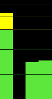

# vu-meter
Audio [VU meter](https://en.wikipedia.org/wiki/VU_meter) for [JACK](https://jackaudio.org/) with any number of channels.

This is heavily inspired by the [cadence-jackmeter](https://github.com/falkTX/Cadence/blob/master/c%2B%2B/widgets/digitalpeakmeter.cpp) included in the [Cadence](https://github.com/falkTX/Cadence) tools. I rewrote it in [Rust](https://www.rust-lang.org/), with freely configurable amount of channels through commandline parameters. It uses [XCB](https://en.wikipedia.org/wiki/XCB) i.e. the X11 protocol for graphics.

# Usage

```
Jack VU-Meter inspired by cadence-jackmeter

Usage: vu-meter [OPTIONS]

Options:
  -c, --channels <CHANNELS>  Sets the number of input channels [default: 2]
  -C, --connect <CONNECT>    Automatically connect ports to vu-meter on startup. Format is `channel:port` where `channel` is the VU meter channel number starting from 1 and `port` is the output port to connect to. Can be given any number of times
  -h, --help                 Print help
  -V, --version              Print version
```
N.B. it does not automatically reconnect connections requested with `-C`/`--connect` if they later get disconnected for any reason. It also does not reconnect if JACK is shut down.

# Screenshot



# Compiling

* [Install Rust](https://www.rust-lang.org/tools/install)
* Compile using 
```sh
cargo build --release
```
* Run `target/release/vu-meter` or copy it to some directory in your path, for example `${HOME}/bin/`
